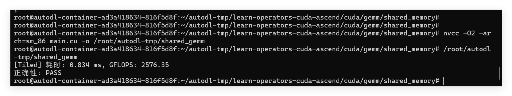

# v1：Shared Memory Tiled GEMM

## 本版做了什么

FP32 行主序矩阵乘法 `C[M×N] = A[M×K] × B[K×N]`，当前 `M=N=K=1024`。每个 `16×16` 线程块计算一个 `C` 子块：线程协作把 A、B 的子块装入 Shared Memory，同步后计算 16 项乘加，再同步并加载下一组子块。沿 K 方向共处理 64 个子块。每个线程用 `float sum` 累加一个输出元素。

与 Naive 版本相比，本版的主要改变是一个线程块内复用 A、B 子块，而不是每次乘加都按原索引从 Global Memory 取数。是否减少了实际 DRAM 流量，仍需 Profiling 验证。

## 编译和运行

在 AutoDL 的仓库根目录执行：

```bash
nvcc -O2 -arch=sm_86 cuda/gemm/shared_memory/main.cu -o /root/autodl-tmp/shared_gemm
/root/autodl-tmp/shared_gemm
```

## 本次运行记录

| 项目 | 记录 |
| --- | --- |
| 日期 | 2026-09-30 |
| GPU | RTX 3080 Ti |
| 精度与尺寸 | FP32，1024×1024×1024 |
| 线程块 | 16×16 |
| 编译选项 | `nvcc -O2 -arch=sm_86` |
| 正确性 | PASS；与 CPU 参考结果比较，阈值为 `1e-3 + 1e-5×abs(C_cpu)` |
| Kernel 时间 | 0.834 ms |
| 吞吐量 | 2576.35 GFLOPS |
| 与 Naive 单次时间之比 | `1.109 / 0.834 ≈ 1.33×`，仅作观察 |
| 预热／重复次数 | 未做预热和多轮统计；当前为单次结果 |
| Profiling | 未做 |

计算量按 `2×M×N×K = 2,147,483,648 FLOP` 估算。CUDA Event 只计 Kernel，不包含 CPU 参考计算、显存分配或主机与 GPU 之间的数据拷贝。



## 正式对比待补

- 从本地 GitHub 版本拉取源码后，记录编译运行所用的提交号。
- Naive 和本版使用相同的预热次数、重复次数与统计方法，记录中位时间和稳定加速比。
- 记录最大绝对／相对误差，而不只记录 PASS。
- 稳定基线建立后，用 Nsight Compute 对照访存和计算指标；Profiler 耗时不当作普通 benchmark 耗时。
